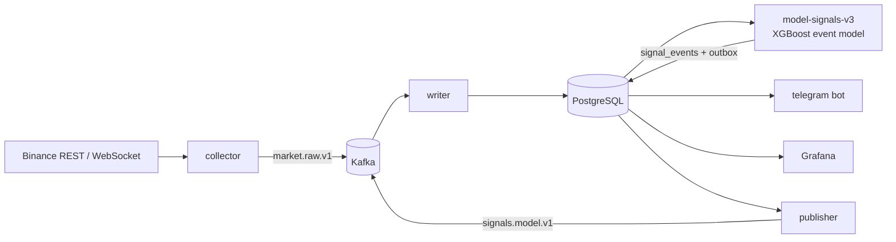

# BTC Event-Driven Signal Pipeline

A real-time machine learning system for **BTCUSDT perpetual futures** (Binance). It streams market data into Kafka and PostgreSQL, detects anomalous candles, and scores each one with an XGBoost model trained on **actual trade outcomes**. Qualifying signals are pushed to Telegram, and every trade is tracked automatically until it hits TP, hits SL or times out.

> Research project. Not financial advice. All results below are out-of-sample and include trading fees.

---

## Highlights

- **Streaming pipeline.** A REST + WebSocket collector feeds Kafka. An idempotent writer stores the data in PostgreSQL, and a transactional outbox publishes downstream. The stack runs in Docker Compose with Grafana monitoring.
- **Event-driven modelling.** The model is trained and evaluated only on anomalous market moments, not on every bar:
  - **E1:** a 5-minute candle with range ≥ 0.5% that is ≥ 3× the recent median.
  - **E2:** the last three 5m candles show ≥ 2.5× the volatility of the 45 before them.
  - **E3:** a 1-minute candle inside the bar with range **and** volume ≥ 6× normal.
- **Trading-objective labels.** Each event is simulated on 1-minute candles for both long and short: market entry, SL = TP = 2σ(1h) (minimum 0.6%), and a 4-hour time stop. The model predicts P(TP), P(SL) and P(timeout), and converts them into **expected R after fees**.
- **Leakage-safe evaluation.** Yearly expanding-window walk-forward with purged boundaries, thresholds chosen only on validation data, and block-bootstrap confidence intervals. Details are in [Methodology](#methodology).
- **Market-structure features.**
  - Causal ZigZag pivots: confirmed only after a 1% reversal, so they never repaint.
  - Volatility compression and expansion.
  - Taker order-flow imbalance, 1-minute micro-structure, funding rate.
  - Features are mirror-symmetric, so a single model serves both long and short.
- **Telegram bot.** Sends signals with entry, SL and TP, then posts the result of each trade (TP, SL or timeout) as a reply under the original message. It also sends health alerts and a daily summary, and answers `/status` and `/last`.

## Architecture



## Methodology

### 1. Samples and labels
- **One sample = one anomaly event** (≈ 13/day, 29k events from 2020-07 to 2026-10). Ordinary bars are never used for training or testing.
- **The label is a simulated trade, not a price direction.** Each event is labelled for both long and short:
  - entry at the **open of the next 1-minute candle** after the 5m bar closes (not at the signal close, so there is no look-ahead fill);
  - SL = TP = clip(2·σ₁ₕ, 0.6%, 3%), with a 4-hour time stop;
  - path-dependent exit on 1-minute high/low. If SL and TP fall in the same minute, SL is assumed. Gaps through a level fill at the open.
  - Classes are {SL, TP, timeout}; the realised R of each class is also stored.
- **Mirror augmentation.** Each event becomes two rows, long and short. Directional features flip sign, and paired features (distance to high and to low) swap. A single model therefore learns both sides symmetrically and the training data doubles.

### 2. Causality (no look-ahead)
- Every feature is computed at the 5m close from past data only: rolling statistics are shifted, ZigZag pivots exist only once confirmed by a 1% reversal, and funding is stamped at its settlement time.
- Unit tests recompute features on truncated history and require identical values. The live worker, which uses 20 days of history, reproduces the backtest to 1e-13.

### 3. Walk-forward split (expanding window, by calendar year)

```
           2020-07 ─────────────── Y-1 ─────────── Y ─────────── Y+1
fold Y :   [ train ··········· ]  [ val: ES │ thr ] [   test   ]
                               ↑ purge 4h  ↑ purge 4h
```

| Part | Content | Purpose |
|---|---|---|
| Train | all events from 2020-07 up to 1 Jan (Y−1); the label horizon must end before the boundary | fit trees, with exponential recency weights (half-life 720 days) |
| Validation, first 60% | events in year Y−1 | early stopping (multi-class log-loss) |
| Validation, last 40% | after a 4h purge gap | choose the entry threshold |
| Test | year Y, never touched before | report results |

Folds Y = 2022 … 2026. The **production model** uses the same recipe: train on everything except the last 365 days, then early-stop and calibrate the threshold on those 365 days.

### 4. Model and decision rule
- XGBoost `multi:softprob`: depth 3, learning rate 0.02, up to 2,000 trees, `min_child_weight=30`, subsample 0.7, column sample 0.6, L2 = 10.
- **Expected R after fees** = P(TP)·1 − P(SL) + P(timeout)·R̄_timeout − fee/SL, where R̄_timeout is the mean timeout R in the training set. The side with the higher expected R is chosen.
- **Threshold selection** uses validation data only: from {0, 0.05, …, 0.4} it takes the value that maximises *mean R − 1 standard error* with at least 30 trades. This is conservative against lucky thresholds.

### 5. Evaluation
- Out-of-sample trades are pooled across folds. 90% confidence intervals come from a **weekly block bootstrap**, because trades in the same week are correlated.
- Results are reported per year, per event type and at fixed thresholds, together with a calibration table of predicted vs realised R.

| Test year | Train events | Threshold | Trades | Avg R (net) |
|---|---|---|---|---|
| 2022 | 2,117 | 0.00 | 1,100 | −0.076 |
| 2023 | 5,353 | 0.05 | 428 | −0.111 |
| 2024 | 10,552 | 0.00 | 1,387 | +0.039 |
| 2025 | 17,149 | 0.00 | 1,065 | +0.001 |
| 2026 (to Oct) | 21,065 | 0.00 | 805 | −0.063 |

### 6. Research log (what was tried and rejected)
1. **Bar-level direction model (v2)** on every 5m bar: out-of-sample AUC 0.54–0.60, but all execution variants lost money after fees (−0.03 to −0.07 R). Signals spread over every bar were too weak to pay costs, which motivated restricting the model to events.
2. **Confidence filters on v2** (|p − 0.5| or expected R): the selected thresholds flipped sign on the hold-out period, which is an overfitting signature.
3. **Event model with TP > SL** (TP 1.5–3× SL): TP was hit in only 10–35% of trades inside 4 hours, and every template lost money out of sample.
4. **Event model with TP = SL** (current): the first version with a positive gross edge.

## Results (out-of-sample 2022–2026, after 0.1% round-trip fees)

| Metric | Value |
|---|---|
| Trades | 4,785 (~84 / month) |
| Take-profit / Stop-loss / Timeout | 36.6% / 26.9% / 36.5% |
| Win rate (resolved trades, TP = SL) | 57.6% |
| Average R per trade, gross | ≈ +0.05 R |
| Average R per trade, net of fees | −0.026 R (90% CI −0.059 … +0.005) |

**Findings**
- After an anomalous 5m candle, price moves ≥ 1% within 4 hours **78%** of the time, against 50% for ordinary bars. Anomalies do predict *volatility*.
- *Direction* after an anomaly is only weakly predictable (AUC 0.50–0.53). The sign flips with the market regime: mean reversion in 2022–23, trend following in 2024.
- The model has a real gross edge (TP hit more often than SL), but trading costs absorb it. Reducing execution costs, or adding order-book and liquidation data, is the next lever.

## Tech stack

Python 3.10–3.12 · pandas · NumPy · Numba · XGBoost · scikit-learn · Kafka (KRaft) · PostgreSQL 17 · Docker Compose · Grafana · httpx / websockets · Telegram Bot API

## Project structure

```
pipeline/            real-time services (collector, writer, publisher, model workers, telegram bot)
model_training/      modelv3.py + trainv3.ipynb  - event-driven trading model (production)
                     modelv2.py + trainv2.ipynb  - earlier bar-level direction model (baseline)
                     execution_m1.py             - execution backtester on 1-minute candles
historical_tests/    unit and integration tests (PostgreSQL-backed where noted)
sql/schema.sql       database schema
monitoring/          Grafana provisioning and dashboard
collect_historical.py  bulk download of historical klines + funding from Binance
```

## Quick start

```bash
# 1. Historical data and model
python collect_historical.py --timeframes 1m 5m
jupyter lab model_training/trainv3.ipynb      # writes artifacts/5m_event_v3/model_v3.joblib

# 2. Configuration
cp .env.example .env                          # set POSTGRES_PASSWORD, TELEGRAM_BOT_TOKEN
docker compose run --rm telegram python -m pipeline telegram-setup   # prints your TELEGRAM_CHAT_ID

# 3. Run
docker compose up -d --build
docker compose run --rm cli                   # pipeline status
```

Grafana: http://localhost:3000 · Kafka UI: http://localhost:8080

## Tests

```bash
python -m unittest historical_tests.test_modelv3 historical_tests.test_telegram \
    historical_tests.test_new_sources historical_tests.test_validation historical_tests.test_timeframes
# Database integration tests run when TEST_DATABASE_URL points to an empty PostgreSQL database
```

## Disclaimer

This project is for research and education. It does not place orders, and nothing here is investment advice.
