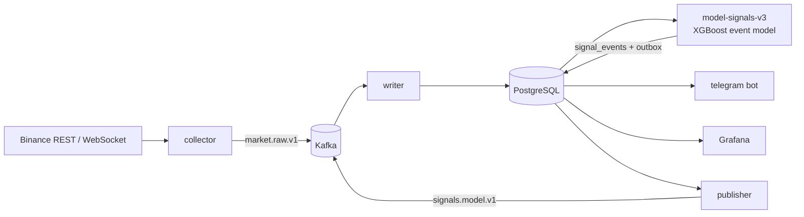

# BTC Event-Driven Signal Pipeline

A real-time machine learning system for **BTCUSDT perpetual futures** (Binance). It streams market data into Kafka and PostgreSQL, detects anomalous candles, and scores each one with an XGBoost model trained on **actual trade outcomes**. Qualifying signals are pushed to Telegram, and every trade is tracked automatically until it hits TP, hits SL or times out.

> Research project. Not financial advice. All results below are out-of-sample and include trading fees.

---

## Highlights

- **Streaming pipeline.** A REST + WebSocket collector feeds Kafka. An idempotent writer stores the data in PostgreSQL, and a transactional outbox publishes downstream. The stack runs in Docker Compose with Grafana monitoring.
- **Event-driven modelling.** The model is trained and evaluated only on anomalous market moments, not on every bar:
  - **E1:** a 5-minute candle with range ≥ 0.5% that is ≥ 3× the recent median.
  - **E2:** the last three 5m candles show ≥ 2.5× the volatility of the 45 before them.
  - **E3:** a 1-minute candle inside the bar with range **and** volume ≥ 6× normal.
- **Trading-objective labels.** Each event is simulated on 1-minute candles for both long and short: market entry, SL = TP = 2σ(1h) (minimum 0.6%), and a 4-hour time stop. The model predicts P(TP), P(SL) and P(timeout), and converts them into **expected R after fees**.
- **Leakage-safe evaluation.**
  - Walk-forward by year, with a purge gap equal to the holding period.
  - Thresholds are chosen on the validation year only.
  - Block-bootstrap confidence intervals.
  - Tests check that features use past data only and that live features match batch features.
- **Market-structure features.**
  - Causal ZigZag pivots: confirmed only after a 1% reversal, so they never repaint.
  - Volatility compression and expansion.
  - Taker order-flow imbalance, 1-minute micro-structure, funding rate.
  - Features are mirror-symmetric, so a single model serves both long and short.
- **Telegram bot.** Sends signals with entry, SL and TP, then posts the result of each trade (TP, SL or timeout) as a reply under the original message. It also sends health alerts and a daily summary, and answers `/status` and `/last`.

## Architecture



## Results (out-of-sample 2022–2026, after 0.1% round-trip fees)

| Metric | Value |
|---|---|
| Trades | 4,785 (~84 / month) |
| Take-profit / Stop-loss / Timeout | 36.6% / 26.9% / 36.5% |
| Win rate (resolved trades, TP = SL) | 57.6% |
| Average R per trade, gross | ≈ +0.05 R |
| Average R per trade, net of fees | −0.026 R (90% CI −0.059 … +0.005) |

**Findings**
- After an anomalous 5m candle, price moves ≥ 1% within 4 hours **78%** of the time, against 50% for ordinary bars. Anomalies do predict *volatility*.
- *Direction* after an anomaly is only weakly predictable (AUC 0.50–0.53). The sign flips with the market regime: mean reversion in 2022–23, trend following in 2024.
- The model has a real gross edge (TP hit more often than SL), but trading costs absorb it. Reducing execution costs, or adding order-book and liquidation data, is the next lever.

## Tech stack

Python 3.10–3.12 · pandas · NumPy · Numba · XGBoost · scikit-learn · Kafka (KRaft) · PostgreSQL 17 · Docker Compose · Grafana · httpx / websockets · Telegram Bot API

## Project structure

```
pipeline/            real-time services (collector, writer, publisher, model workers, telegram bot)
model_training/      modelv3.py + trainv3.ipynb  - event-driven trading model (production)
                     modelv2.py + trainv2.ipynb  - earlier bar-level direction model (baseline)
                     execution_m1.py             - execution backtester on 1-minute candles
historical_tests/    unit and integration tests (PostgreSQL-backed where noted)
sql/schema.sql       database schema
monitoring/          Grafana provisioning and dashboard
collect_historical.py  bulk download of historical klines + funding from Binance
```

## Quick start

```bash
# 1. Historical data and model
python collect_historical.py --timeframes 1m 5m
jupyter lab model_training/trainv3.ipynb      # writes artifacts/5m_event_v3/model_v3.joblib

# 2. Configuration
cp .env.example .env                          # set POSTGRES_PASSWORD, TELEGRAM_BOT_TOKEN
docker compose run --rm telegram python -m pipeline telegram-setup   # prints your TELEGRAM_CHAT_ID

# 3. Run
docker compose up -d --build
docker compose run --rm cli                   # pipeline status
```

Grafana: http://localhost:3000 · Kafka UI: http://localhost:8080

## Tests

```bash
python -m unittest historical_tests.test_modelv3 historical_tests.test_telegram \
    historical_tests.test_new_sources historical_tests.test_validation historical_tests.test_timeframes
# Database integration tests run when TEST_DATABASE_URL points to an empty PostgreSQL database
```

## Disclaimer

This project is for research and education. It does not place orders, and nothing here is investment advice.
