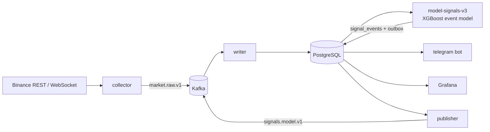

# BTC Event-Driven Signal Pipeline

A real-time machine learning system for **BTCUSDT perpetual futures** (Binance). It streams market data into Kafka and PostgreSQL, detects anomalous candles, and scores each one with an XGBoost model trained on **simulated trade outcomes**. Signals are pushed to Telegram, and each one is tracked automatically until it hits TP, hits SL or times out.

> Research project and live **forward test**: the system publishes and scores signals but never places orders. All results are out-of-sample and net of fees.

---

## Highlights

- **Event-based sampling.** The production model trains and trades only on anomalous moments (≈ 13 per day), not on every bar.
- **Trade-outcome labels.** Labels come from long and short trades simulated on 1-minute candles. The model outputs P(TP), P(SL), P(timeout) and expected R after fees.
- **Leakage-safe evaluation.** Yearly expanding-window walk-forward with purged boundaries, separate early-stopping and threshold-selection sets, and block-bootstrap confidence intervals.
- **Streaming system.** Kafka → PostgreSQL with idempotent writes and a transactional outbox, Docker Compose, and Grafana. A Telegram bot reports signals, results and health alerts.

## Architecture



## Data and model inputs

### Raw data (Binance USD-M, BTCUSDT, 2020-07 → present)

| Source | Granularity | Fields used |
|---|---|---|
| Klines | 1 minute | OHLC, volume, number of trades, taker-buy volume |
| Klines | 5 minutes | v2 reads them directly; v3 aggregates them from 1-minute klines |
| Funding rate | every 8 h | rate, stamped at settlement time (when it becomes known) |
| Open interest, long/short ratios | 5 min | collected live only (Binance keeps ~30 days), not yet used in training |

Both models use **fixed-time bars** (1m and 5m), not information-driven bars such as volume, dollar or CUSUM bars. The difference between them is **how training samples are selected**.

### How each model samples, sees and learns from the data

| | **v3 – event model (production)** | **v2 – bar-level model (baseline)** |
|---|---|---|
| Sampling unit | **anomaly event** at a 5m close (event filter, ≈ 13/day) | **every 5m bar** (stride 1) |
| Training samples | 29k events × 2 sides (mirror) | 656k bars (direction heads: every 2nd bar × mirror) |
| Event / sample filter | E1: 5m range ≥ 0.5% and ≥ 3× the 48-bar median · E2: mean range of the last 3 bars ≥ 2.5× the previous 45 · E3: a 1m candle with range **and** volume ≥ 6× the 240-minute median | none |
| Look-back windows | 5m: 3 → 2,880 bars (15 min → 10 days); 1m: 5 → 240 bars | 288-bar (24 h) window + multi-day context (up to 10 days) |
| Feature groups | event candle shape, 1m micro-structure, volatility compression/expansion, multi-horizon returns, EMA/RSI, range position, **ZigZag 1%** structure, taker imbalance, trade count/size, funding | **ZigZag 0.5%** pivot geometry (last 8 pivots: legs, channels, levels), multi-scale ZigZag (0.5–4× barrier), momentum, VWAP, prior day/week anchors, taker flow, funding, regime |
| Number of features | 65 (one model; mirrored for short) | 101 (touch) + 114 (direction) |
| Target | 3-class trade outcome {SL, TP, timeout} for each side | triple-barrier: P(touch ±b), P(up \| touch), P(2b \| up), E[R \| timeout] |
| Barrier / trade | SL = TP = clip(2·σ₁ₕ, 0.6%, 3%), simulated on **1m** candles, entry at the next 1m open | b = clip(σ·√48, 0.7%, 3%) on 5m candles, entry at the next 5m open |
| Horizon | 4 h | 4 h (48 bars) |
| Recency weighting | exponential, half-life 720 days | exponential, half-life 540 days (floor 0.2) |
| Calibration | entry threshold chosen on validation | temperature scaling on validation |

**Why event sampling?** On ordinary bars price barely moves, so the label is mostly noise. After an E1 event, price moves ≥ 1% within 4 hours **78%** of the time, against 50% for an ordinary bar. Event sampling concentrates training on moments where a trade can actually pay its costs, and it reduces overlapping, highly correlated samples.

**Causality.** Every feature is computed at the 5m close from past data only:
- rolling statistics are shifted;
- ZigZag pivots exist only after the reversal threshold has confirmed them, so they never repaint;
- funding is joined as of its settlement time.

Unit tests recompute features on truncated history and require identical values. The live worker, which uses 20 days of history, reproduces the backtest features to 1e-13.

## Methodology (v3)

### Labels and side symmetry
- Each event is labelled for **both** long and short:
  - entry at the open of the next 1-minute candle (no look-ahead fill);
  - exit by a path-dependent scan of 1-minute high/low;
  - SL is assumed if SL and TP fall in the same minute, and a gap through a level fills at the open;
  - 4-hour time stop.
- **Mirror augmentation.** Each event becomes two rows. Directional features flip sign, and paired features (distance to pivot high and pivot low) swap. One model learns both sides with no built-in long or short bias.

### Walk-forward split (expanding window, by calendar year)

```
           2020-07 ─────────────── Y-1 ─────────── Y ─────────── Y+1
fold Y :   [ train ··········· ]  [ val: ES │ thr ] [   test   ]
                               ↑ purge 4h  ↑ purge 4h
```

| Part | Data | Used for |
|---|---|---|
| Train | events from 2020-07 to 1 Jan (Y−1); label horizon must end before the boundary | fitting, with recency weights |
| Validation, first 60% | events in year Y−1 | early stopping (multi-class log-loss) |
| Validation, last 40% | after a 4h purge gap | choosing the entry threshold |
| Test | year Y, untouched until evaluation | reported results |

Folds Y = 2022 … 2026. The production model uses the same recipe on the most recent data: train on everything except the last 365 days, then early-stop and choose the threshold on those 365 days.

### Model and decision rule
- XGBoost `multi:softprob`: depth 3, learning rate 0.02, up to 2,000 trees, `min_child_weight=30`, subsample 0.7, column sample 0.6, L2 = 10.
- **Expected R** = P(TP) − P(SL) + P(timeout)·R̄_timeout − fee/SL. The side with the higher expected R is chosen.
- **Threshold** from {0, 0.05, …, 0.4}: the one that maximises *mean R − 1 standard error* on the threshold-selection set, with at least 30 trades. This guards against lucky thresholds.

### Evaluation
- Out-of-sample trades are pooled across folds. 90% confidence intervals use a **weekly block bootstrap**, because trades in the same week are correlated.
- Results are broken down by year, by event type and at fixed thresholds, with a calibration table of predicted vs realised R.

| Test year | Train events | Threshold | Trades | TP / SL | Avg R (net) |
|---|---|---|---|---|---|
| 2022 | 2,117 | 0.05 | 657 | 36.5% / 34.2% | −0.093 |
| 2023 | 5,353 | 0.05 | 451 | 34.8% / 33.3% | −0.142 |
| 2024 | 10,552 | 0.05 | 704 | 42.0% / 24.3% | +0.066 |
| 2025 | 17,149 | 0.05 | 479 | 38.0% / 26.3% | −0.020 |
| 2026 (to Oct) | 21,065 | 0.05 | 249 | 33.3% / 28.1% | −0.061 |

### Research log (what was tried and rejected)
1. **Bar-level direction model (v2):** out-of-sample AUC 0.54–0.60, but every execution variant lost money after fees (−0.03 to −0.07 R). The signal was spread over every bar and too weak to pay costs, which motivated event sampling.
2. **Confidence filters on v2** (|p − 0.5| or expected R): the selected thresholds flipped sign on the hold-out period, which is an overfitting signature.
3. **Event model with TP > SL** (TP 1.5–3× SL): TP was hit in only 10–35% of trades within 4 hours, and every template lost money out of sample.
4. **Event model with TP = SL** (current): the first version with a positive gross edge.

## Results (out-of-sample 2022–2026, 0.1% round-trip fees)

| Metric | Value |
|---|---|
| Trades | 2,540 (~45 / month) |
| Take-profit / Stop-loss / Timeout | 37.7% / 29.2% / 33.1% |
| Win rate (resolved trades, TP = SL) | 56.4% |
| Average R per trade, gross | +0.056 R |
| Average R per trade, net of fees (≈ 0.10 R) | −0.041 R (90% CI −0.082 … −0.003) |

**Findings**
- Anomalies predict *volatility* well (78% vs 50% chance of a ≥ 1% move in 4 hours).
- *Direction* after an anomaly is only weakly predictable (AUC 0.50–0.53). The sign flips with the market regime: mean reversion in 2022–23, trend following in 2024.
- The model hits TP more often than SL and has a positive gross edge, but trading costs absorb it. The next levers are lower execution costs (maker entries) and new inputs (order book, liquidations, the open-interest data now being collected).

## Tech stack

Python · pandas · NumPy · Numba · XGBoost · scikit-learn · Kafka (KRaft) · PostgreSQL 17 · Docker Compose · Grafana · httpx / websockets · Telegram Bot API

## Project structure

```
pipeline/            real-time services (collector, writer, publisher, model workers, telegram bot)
model_training/      modelv3.py + trainv3.ipynb  - event-driven trade model (production)
                     modelv2.py + trainv2.ipynb  - bar-level triple-barrier model (baseline)
                     execution_m1.py             - execution backtester on 1-minute candles (v2)
historical_tests/    unit and integration tests
sql/schema.sql       database schema
monitoring/          Grafana provisioning and dashboard
collect_historical.py  bulk download of klines + funding from Binance
```

## Quick start

```bash
# 1. Historical data and model
python collect_historical.py --timeframes 1m 5m
jupyter lab model_training/trainv3.ipynb      # writes artifacts/5m_event_v3/model_v3.joblib

# 2. Configuration
cp .env.example .env                          # set POSTGRES_PASSWORD, TELEGRAM_BOT_TOKEN
docker compose run --rm telegram python -m pipeline telegram-setup   # prints your TELEGRAM_CHAT_ID

# 3. Run
docker compose up -d --build
docker compose run --rm cli                   # pipeline status
```

Grafana: http://localhost:3000 · Kafka UI: http://localhost:8080

## Tests

```bash
python -m unittest historical_tests.test_modelv3 historical_tests.test_telegram \
    historical_tests.test_new_sources historical_tests.test_validation historical_tests.test_timeframes
# Database integration tests run when TEST_DATABASE_URL points to an empty PostgreSQL database
```

## Disclaimer

Research and education only. The system does not place orders, and nothing here is investment advice.
